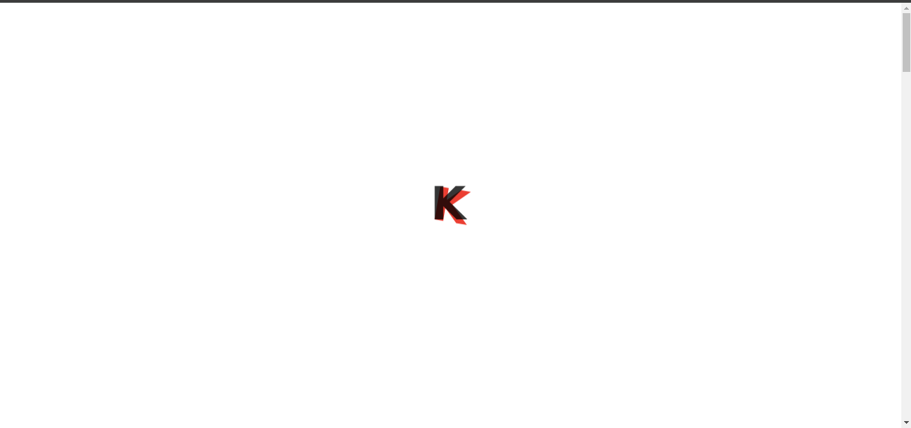
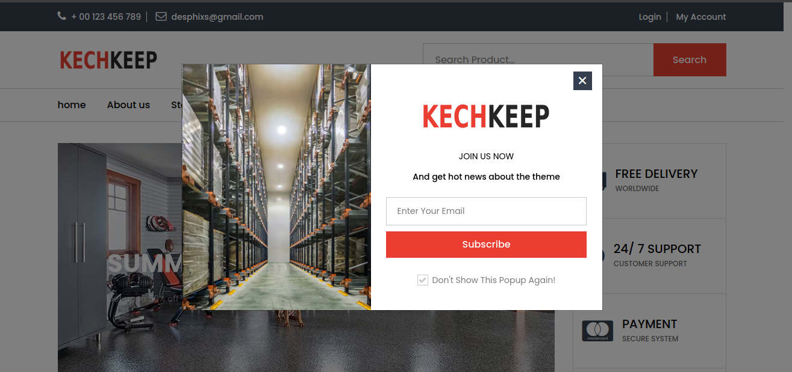
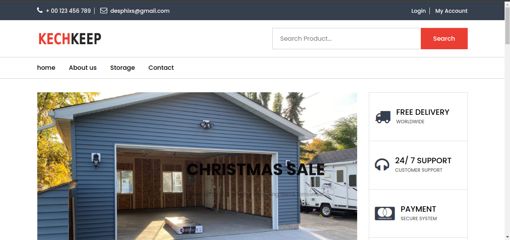
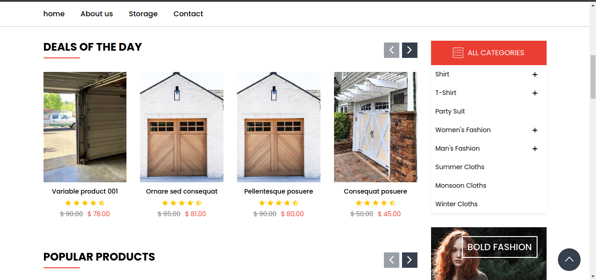
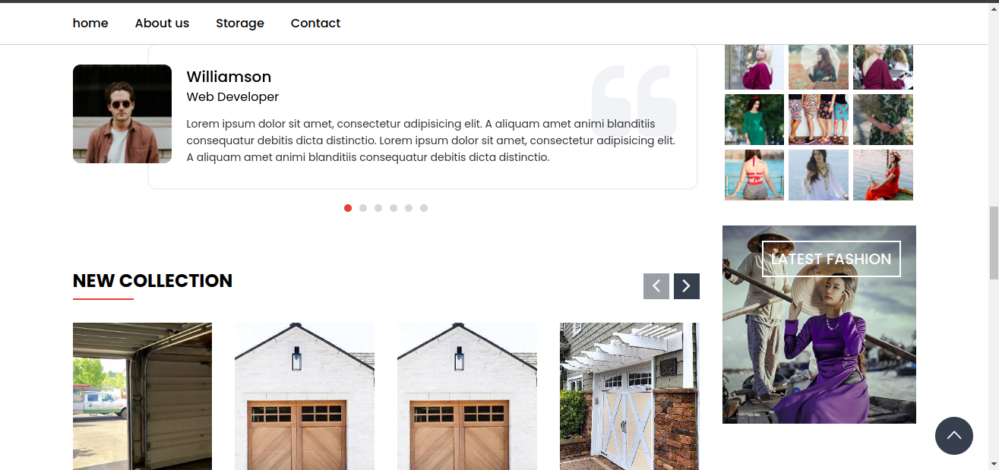
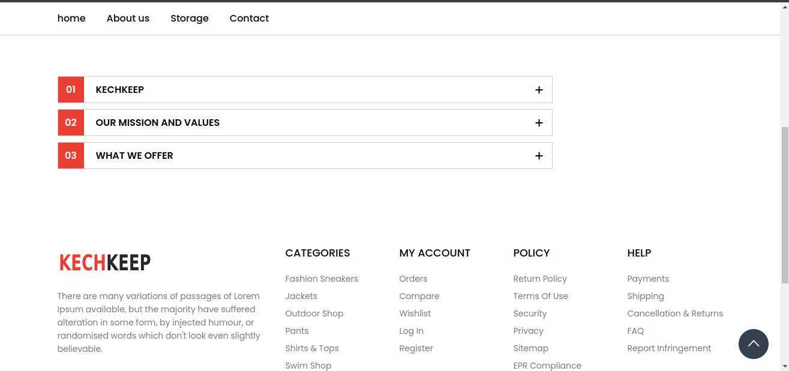

**KechKeep**

KechKeep is a platform designed to facilitate neighborhood connections and storage management. Similar to Neighbor, KechKeep focuses on creating a sense of community among neighbors while also offering a convenient solution for managing storage facilities.

# Features
- Home
- Neighborhood Connectivity: Users can join their neighborhood's network to connect with fellow residents, share updates, and collaborate on various community initiatives.
- Newsfeed: Stay updated with the latest announcements, events, and discussions within your neighborhood.
- Post Sharing: Share posts, articles, and announcements with neighbors to keep everyone informed and engaged.
- Community Forums: Participate in community forums to discuss local topics, share recommendations, and ask for help or advice.
- Contact
- Direct Messaging: Communicate with individual neighbors through direct messaging for private conversations.
- Group Messaging: Create and participate in group chats to coordinate activities, organize events, or discuss shared interests.
- Emergency Alerts: Receive important notifications and emergency alerts from local authorities or neighborhood watch groups.
- Admin Panel
- Storage Management: Admins can use the admin panel to add, edit, and manage storage facilities within the neighborhood.
- User Management: Admins have the ability to manage user accounts, permissions, and access levels.
- Content Moderation: Ensure that the platform maintains a positive and safe environment through content moderation tools and features.
# Getting Started
To get started with KechKeep, follow these steps:

Sign Up: Create an account on KechKeep using your email address or social media accounts.

Join Your Neighborhood: Find and join your neighborhood's network to start connecting with neighbors.

Explore Features: Explore the different features of KechKeep, such as the newsfeed, forums, and messaging.

Admin Access: If you're an admin, log in to the admin panel to manage storage facilities and user accounts.

Contributing

We welcome contributions from the community to help improve and enhance KechKeep. If you're interested in contributing, please follow these guidelines:

# Fork the repository.
Make your changes and enhancements.

Submit a pull request, describing the changes you've made and their purpose.

Support

If you encounter any issues or have any questions about KechKeep, please reach out to our support team at i.zagaouch@gmail.com.

# License
KechKeep is licensed under the MIT License. See the LICENSE file for more details.

